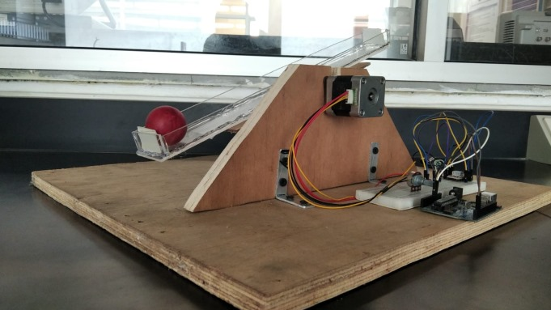

# Ball and Beam Self-Balancing System

This project implements a self-balancing ball-and-beam system using computer vision, PID control, and stepper motor actuation. The system uses a Python script to track the position of a red ball on a beam and sends control signals to an Arduino Uno, which adjusts the beam's angle to maintain balance.




## Overview

The system achieves balance by:
- Using a camera and OpenCV to track the ball's position in real time.
- Calculating the distance of the ball from the desired center position.
- Sending control signals via serial communication to an Arduino Uno, which controls a stepper motor to tilt the beam.
- Implementing a PID controller for precise and responsive adjustments.

This project demonstrates principles of control systems, computer vision, and mechatronics.

## Features

- **Real-Time Ball Tracking**: Tracks a red ball on the beam using OpenCV.
- **PID Controller**: Stabilizes the ball by adjusting the beam angle dynamically.
- **Stepper Motor Control**: Precise actuation of the beam using a NEMA-17 stepper motor.

## Files

- **`Upload_on_the_Arduino.ino`**: Arduino code for controlling the stepper motor.
- **`ball_tracking.py`**: Python script for ball tracking and PID control.
- **`Detailed Documentation.pdf`**: Detailed report on the design, implementation, and challenges of the system.

## Hardware Requirements

- Arduino Uno
- NEMA-17 Hybrid Bipolar Stepper Motor
- Stepper Motor Driver (e.g., TB6600)
- Camera (e.g., Intel RealSense or equivalent)
- Acrylic beam and lightweight ball
- Supporting frame and fixtures

## Software Requirements

- Python 3.x
- OpenCV Library
- NumPy
- PySerial
- Arduino IDE

## Setup

1. **Arduino Setup**:
   - Upload the `Upload_on_the_Arduino.ino` file to the Arduino Uno using the Arduino IDE.
   - Connect the Arduino to the stepper motor driver and stepper motor as per the provided wiring diagram.

2. **Python Environment**:
   - Install the required Python libraries:
     ```bash
     pip install opencv-python numpy pyserial
     ```
   - Ensure the Python script (`ball_tracking.py`) is set to use the correct COM port for the Arduino connection.

3. **Hardware Assembly**:
   - Assemble the ball-and-beam structure as per the detailed documentation.
   - Position the camera to capture the beam and the ball clearly.

## Usage

1. **Start the Python Script**:
   - Run the `ball_tracking.py` script:
     ```bash
     python ball_tracking.py
     ```
   - Ensure the camera feed is displayed, and the red ball is detected.

2. **Monitor the System**:
   - The ball's position relative to the beam's center will be displayed in the console and on the video feed.
   - Adjustments will be made automatically by the PID controller.

3. **Stop the System**:
   - Press `q` to terminate the Python script and stop the system.

## Challenges Faced

- **Hardware**:
  - Overheating stepper motor drivers resolved by switching to TB6600 drivers.
  - Beam jitter minimized by using smaller step sizes (1/8th of a step).
- **Software**:
  - Camera noise and interference addressed by refining color thresholds.
  - Arduino serial buffer overflow resolved by implementing periodic buffer flushes.

## References

For detailed explanations, refer to the [Detailed Documentation](./Detailed%20Documentation.pdf).

## Authors

- Afsah Hyder
- Ilsa Shariff
- Shameer Masroor

Supervisor: Dr. Shafayat Abrar
